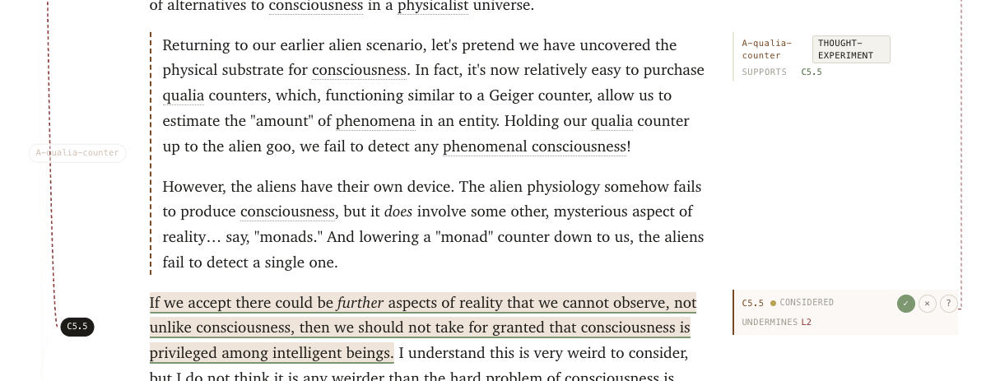

# ArgML

**ArgML** is an XML markup language for inline annotation of argumentative prose — designed to make the structure of philosophical and rationalist essays explicit enough to support double-cruxing, dependency tracing, and automated argument-graph analysis.

This repository is the TypeScript reference implementation of **ArgML 1.0**: parser, validator, CLI, HTML renderer, reader-overlay document type, and a propagation engine that computes a reader's stance over a post's argument graph.

> Status: **pre-alpha**. The spec is at Working Draft 0.2 and the implementation is mid-roadmap (see [Status & roadmap](#status--roadmap)). APIs and on-disk formats may change without notice until 1.0.



A reader marking up a passage in the rendered HTML output: each claim carries a stable id, the gloss column on the right surfaces the argument graph (relation type, mode, attitude controls), and the left gutter shows the claim's typed connections. Marks (`✓` / `✕` / `?`) feed a live propagation engine that updates the takeaways panel and tints the prose by status.

## Table of contents

- [What is ArgML?](#what-is-argml)
- [Install](#install)
- [Quickstart (CLI)](#quickstart-cli)
- [Library usage](#library-usage)
- [Examples](#examples)
- [Use with Claude](#use-with-claude)
- [Documentation](#documentation)
- [Status & roadmap](#status--roadmap)
- [Development](#development)
- [Contributing](#contributing)
- [License](#license)

## What is ArgML?

ArgML lets you annotate prose with a small vocabulary of argumentative elements — `<claim>`, `<assumption>`, `<inference>`, `<argument>`, `<conflict>`, `<term>`, and a few others — and connect them with typed relations (`supports`, `attacks`, `rests-on`, `via`, `same-as`, …). The result is a document that is still readable as prose but is also a machine-checkable argument graph.

A second root document type, `<reader-overlay>`, lets a reader record `accept` / `reject` / `open` attitudes against the elements of imported posts. The two documents together drive the propagation engine that computes which takeaways are still standing under the reader's stance.

Concretely, ArgML aims to enable:

- **Validation** — catch unresolved references, kind mismatches, undeclared imports, mode-attribute violations, and other structural mistakes before publishing.
- **Inspection** — view the dependency tree behind any claim; see what an essay actually rests on.
- **Visualization** — render an essay's argument graph as JSON, DOT/Graphviz, or HTML.
- **Reader overlays** — record `accept` / `reject` / `open` attitudes against a post's claims, assumptions, inferences, and arguments without modifying the original.
- **Propagation analysis** — compute the spec §13.5 four-status classification (`endorsed` / `supported` / `provisional` / `blocked`) for each takeaway, given a post and an overlay.
- **Cross-document linking** — reference claims in other ArgML documents by stable id, so debates can be conducted at the level of specific propositions.

The format is defined in [`spec/argml-spec.md`](./spec/argml-spec.md). When the implementation and the spec disagree, the divergence is logged in [`SPEC-NOTES.md`](./SPEC-NOTES.md) and resolved deliberately, not silently.

## Install

Requires **Node.js ≥ 22** and **pnpm**.

```sh
git clone https://github.com/ianwsperber/arg-ml.git
cd arg-ml
pnpm install
pnpm build
```

To put the `argml` CLI on your `PATH`:

```sh
pnpm link --global
```

The package is not yet published to npm.

## Quickstart (CLI)

All commands take a path to an `.argml.xml` or `.overlay.xml` file. Exit code is `0` on success and non-zero on validation errors or bad input — suitable for use in CI.

| Command | What it does |
|---|---|
| `argml validate <file>` | Parse and validate a `<post>` or `<reader-overlay>`; print diagnostics as `path:line:col: severity code message`. |
| `argml validate <post> --overlay <overlay>` | Validate both documents and report overlay targets that don't resolve in the post. |
| `argml summary <file>` | Structural counts (claims, assumptions, inferences, conflicts, arguments, takeaways, generators, …), import declarations, and cross-document references. Dispatches on root: overlays print attitude / substitution counts instead. |
| `argml deps <file> --target <id>` | ASCII dependency tree for a target id: what it `rests on`, what `supports` it, and what it `supports`. |
| `argml graph <file> [--format json\|dot]` | Emit the argument graph as Cytoscape-shaped JSON (default) or Graphviz DOT. Includes `<argument>` nodes, `same-as` edges, and `via-argument` edges. |
| `argml render <file> [--output <html>]` | Render a `<post>` to a self-contained HTML page with mode badges, argument blocks, takeaways banner, provenance markers, and same-as cross-links. |
| `argml overlay show <file>` | Pretty-print a reader-overlay's attitudes and substitutions in tabular form. |
| `argml propagate <post> --overlay <overlay> [--format text\|json] [--prefix <p>]` | Compute the spec §13.5 four-status propagation table for each takeaway in the post under the overlay. |

### Example session

```sh
# Check a document
argml validate examples/morality-without-consciousness.argml.xml

# Check a post + overlay pair together
argml validate examples/morality-without-consciousness.argml.xml \
              --overlay examples/morality-without-consciousness.overlay.xml

# See what's in a post
argml summary examples/morality-without-consciousness.argml.xml

# Trace what a claim depends on
argml deps examples/morality-without-consciousness.argml.xml --target C3.6

# Render the post to HTML
argml render examples/morality-without-consciousness.argml.xml \
            --output /tmp/essay.html

# Inspect a reader-overlay
argml overlay show examples/morality-without-consciousness.overlay.xml

# Compute the propagation status of each takeaway under a reader's stance
argml propagate examples/morality-without-consciousness.argml.xml \
               --overlay examples/morality-without-consciousness.overlay.xml

# Export to Graphviz and render
argml graph examples/morality-without-consciousness.argml.xml --format dot > arg.dot
dot -Tsvg arg.dot > arg.svg
```

If you haven't run `pnpm link --global`, substitute `pnpm exec argml …` or `node dist/cli/main.js …`.

## Library usage

The public API is exported from the package root. Internal paths are not stable — import only from `argml`.

```ts
import { parseArgML, validate } from "argml";

const source = await readFile("essay.argml.xml", "utf8");
const { document, diagnostics: parseDiagnostics } = parseArgML(source);

const diagnostics = [
  ...parseDiagnostics,
  ...(document ? validate(document) : []),
];

for (const d of diagnostics) {
  console.log(`${d.line}:${d.column}: ${d.severity} ${d.code} ${d.message}`);
}
```

For overlays and post + overlay propagation:

```ts
import { parse, parseArgML, propagate, validateAny } from "argml";

const post = parseArgML(await readFile("essay.argml.xml", "utf8")).document!;
const overlay = parse(await readFile("essay.overlay.xml", "utf8")).document!;
if (overlay.kind !== "reader-overlay") throw new Error("expected an overlay");

const result = propagate(post, overlay);
for (const t of result.takeaways) {
  console.log(`${t.id} (${t.priority ?? "?"}): ${t.status}`);
  if (t.rejectedAncestors.length) console.log(`  blocked by: ${t.rejectedAncestors.join(", ")}`);
  if (t.openAncestors.length) console.log(`  open: ${t.openAncestors.join(", ")}`);
}
```

Other useful exports:

- `parse(xml)` — root-dispatching parser; returns either a post or an overlay.
- `parseReaderOverlay(xml)` — strict overlay parser.
- `serializeArgML(post)` / `serializeReaderOverlay(overlay)` — round-trip back to XML.
- `validateOverlay(overlay)` / `validateAny(doc)` — validation for overlays and the dispatching form.
- `renderHTML(post, options)` — produce a self-contained HTML page from a post.
- `computeEquivalenceClasses(post)` / `buildPropagationGraph(post, eq)` — the building blocks behind `propagate`, exposed for tooling that wants to inspect the graph directly.

Parser and validator return diagnostic arrays; they never throw on user input. Diagnostic codes (`PARSE…`, `ARGML…`, `OVERLAY…`, `PROP…`) are stable identifiers documented in [`SPEC-NOTES.md`](./SPEC-NOTES.md).

Code in `src/` is written to run in both Node and the browser; modules under `viewer/` are the only browser-only ones.

## Examples

Hand-marked sample documents live in [`examples/`](./examples/):

- [`examples/morality-without-consciousness.argml.xml`](./examples/morality-without-consciousness.argml.xml) — the canonical worked example, exercising every 0.2 construct (modes on claims, `<argument>` regions, `<takeaways>`, `<provenance>`, `same-as`, inference patterns).
- [`examples/morality-without-consciousness.overlay.xml`](./examples/morality-without-consciousness.overlay.xml) — a reader-overlay against that post, reproducing spec Appendix B.2.
- [`examples/consciousness-without-morality.md`](./examples/consciousness-without-morality.md) — the underlying prose.
- [`examples/rendered/`](./examples/rendered/) — HTML output, regenerated by `pnpm render-examples`.

Running `argml propagate` on the post + overlay pair reproduces the spec Appendix B propagation table verbatim:

```
  C6.7  primary       provisional            C4.5
  C4.9  secondary     provisional            C4.5
  C3.6  load-bearing  blocked      I-3.1
```

## Use with Claude

This repo ships a Claude skill (`argml-converter`) that converts a blog post or pasted Markdown into ArgML. The skill source is [`skills/argml-converter/SKILL.md`](./skills/argml-converter/SKILL.md). It works in both Claude Code and Claude.ai.

**Claude Code** — install via the bundled marketplace:

```text
/plugin marketplace add ianwsperber/arg-ml
/plugin install argml@argml
```

Once installed, ask Claude to "argml this post" and paste a URL or Markdown. The skill fetches the live spec from `main` before converting and writes a draft `.argml.xml` for review.

**Claude.ai** — zip the skill directory and upload via Settings → Capabilities → Skills:

```sh
( cd skills && zip -r ../argml-converter.zip argml-converter )
```

The plugin manifest is [`.claude-plugin/marketplace.json`](./.claude-plugin/marketplace.json). See Anthropic's [skills docs](https://code.claude.com/docs/en/skills) and [plugin marketplaces docs](https://code.claude.com/docs/en/plugin-marketplaces) for the underlying mechanics.

## Documentation

- [`spec/argml-spec.md`](./spec/argml-spec.md) — the format specification (Working Draft 0.2). Source of truth for syntax, semantics, and conformance.
- [`CHANGELOG.md`](./CHANGELOG.md) — phase-by-phase completion log.
- [`SPEC-NOTES.md`](./SPEC-NOTES.md) — log of implementation / spec divergences and diagnostic-code reference.
- [`docs/adr/`](./docs/adr/) — architecture decision records.
- [`PLAN.md`](./PLAN.md) — pointer to the implementation project plan.

## Status & roadmap

| Phase | Deliverable | Status |
|---|---|---|
| 1 | Core data model + parser | ✅ |
| 2 | Validator with stable diagnostic codes | ✅ |
| 3 | `argml` CLI (`validate`, `summary`, `deps`, `graph`) | ✅ |
| 4 | HTML renderer | ✅ |
| 4.1 | Spec ratification (WD 0.2) | ✅ |
| 4.2 | Post-document 0.2 extensions (modes, `<argument>`, `<takeaways>`, `<provenance>`, `same-as`, patterns) | ✅ |
| 4.3 | `<reader-overlay>` document type (parser, validator, CLI) | ✅ |
| 4.4 | Local propagation engine (spec §13.5 four-status classification) | ✅ |
| 5 | LLM-assisted Markdown → ArgML conversion | 🚧 next |
| 6 | Interactive argument-graph viewer | planned |
| 7 | Cross-document reference resolution | planned |
| 8 | 1.0 hardening | planned |

The most recent completed phase is at the top of [`CHANGELOG.md`](./CHANGELOG.md).

## Development

```sh
pnpm install         # install dependencies
pnpm test            # run vitest
pnpm typecheck       # strict TypeScript checks
pnpm lint            # biome check (lint + format)
pnpm lint:fix        # biome with auto-fixes
pnpm build           # compile to dist/
pnpm render-examples # regenerate examples/rendered/
```

Run `pnpm typecheck && pnpm test && pnpm lint` before every commit.

Conventions in brief:

- TypeScript `strict: true`. No `any` — use `unknown` and narrow.
- Biome for lint + format. No ESLint, no Prettier.
- Vitest, with tests co-located next to their source (`foo.ts` / `foo.test.ts`).
- Named exports only.
- Tests import from the package's public API, not internal paths.

The full set of project conventions is in [`CLAUDE.md`](./CLAUDE.md).

## Contributing

Issues and pull requests are welcome. Before opening a non-trivial PR:

1. Read the relevant section of [`spec/argml-spec.md`](./spec/argml-spec.md) and the current phase in [`CHANGELOG.md`](./CHANGELOG.md).
2. If your change implies a change to the spec, propose it in [`SPEC-NOTES.md`](./SPEC-NOTES.md) first.
3. Substantive design decisions get an ADR in [`docs/adr/`](./docs/adr/).
4. Every PR should include tests, a `CHANGELOG.md` entry, and any necessary `SPEC-NOTES.md` updates.

Phases proceed in order; please check that your change fits the current phase's scope before investing significant work.

## License

[MIT](./LICENSE) © 2026 Ian Walker-Sperber.
