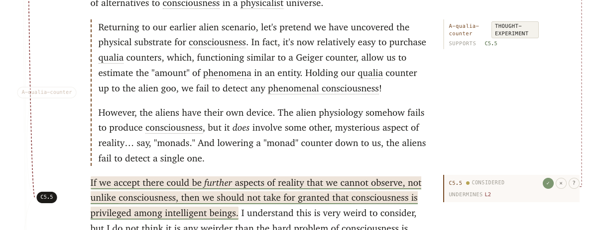

# ArgML

[**ArgML**](https://github.com/ianwsperber/arg-ml/blob/main/spec/argml-spec.md) is an XML markup language for inline annotation of argumentative prose. As of Working Draft 0.3 it binds an essay's claims to the nodes of a Bayesian belief network in the [SBBN Workbench](https://github.com/kristoforusbryant/sbbn-workbench) format, embeds a self-contained snapshot of that network, and defines a claim's credence as the computed posterior rather than an author's assertion. The aim is still double-cruxing, but the crux is now a prior, a probability table row, or an observation, each with an identifier, a rationale, and sources.

My hope is that this could eventually (a) expedite transfer of knowledge, and (b) provide stronger guarantees for the accuracy of AI-generated research and writing. [A short write-up of the motivations for this proposal can be found in the docs.](https://github.com/ianwsperber/arg-ml/blob/main/docs/Proposal.md)

The latest spec is always available at [spec/argml-spec.md](https://github.com/ianwsperber/arg-ml/blob/main/spec/argml-spec.md).

This repository also contains the TypeScript reference implementation.

> Status: **pre-alpha, mid-transition**. The spec is at **Working Draft 0.3** (Bayesian semantics over SBBN; see [`docs/adr/0002-bayesian-semantics-over-sbbn.md`](./docs/adr/0002-bayesian-semantics-over-sbbn.md)). The code in `src/` still implements **Working Draft 0.2** (parser, validator, CLI, HTML renderer, reader overlays, propagation) and is being brought up to 0.3 in Phases 7–10 (see [Status & roadmap](#status--roadmap)). Until then the CLI commands and the `argml-converter` skill below operate on 0.2 documents, whose spec is archived at [`spec/historical/argml-spec-0.2.md`](./spec/historical/argml-spec-0.2.md). APIs and on-disk formats may change without notice until 1.0.



The 0.2 renderer, kept for reference: each claim carries a stable id, the gloss column surfaces the argument graph, and reader marks feed a propagation engine. The 0.3 line removes this renderer; a 0.3 renderer is deferred work.

## Table of contents

- [What is ArgML?](#what-is-argml)
- [Install](#install)
- [Quickstart (CLI)](#quickstart-cli)
- [Library usage](#library-usage)
- [Examples](#examples)
- [Use with Claude](#use-with-claude)
- [Documentation](#documentation)
- [Status & roadmap](#status--roadmap)
- [Development](#development)
- [Contributing](#contributing)
- [License](#license)

## What is ArgML?

An ArgML 0.3 document is prose whose `<claim>` elements bind to a Bayesian network. The intended workflow is that an author (increasingly, an AI research agent) first builds a topic in the SBBN Workbench, with the hypothesis, the latent mechanisms, the observable evidence, and elicited probability tables, and then writes an essay against it:

```xml
<post xmlns="urn:argml:v2">
  <head>
    <metadata><title>Is celebrity A a smoker?</title><author>IanWS</author></metadata>
    <model topic="topics/celebrity-smoking-status/bn.xml" thesis="is-smoker">
      <BIF xmlns="" VERSION="0.3"><NETWORK> <!-- SBBN XMLBIF, copied verbatim --> </NETWORK></BIF>
    </model>
  </head>
  <body>
    <p><claim node="is-smoker">A is, I think, a regular smoker.</claim></p>
    <p><claim node="dyspnoea">A has been short of breath for months.</claim></p>
    <p><claim edge="is-smoker lung-cancer">Smoking is the dominant cause of lung cancer.</claim></p>
    <p><claim node="tuberculosis" state="False">TB is unlikely to be the whole story.</claim></p>
    <p><claim node="is-smoker" given="tuberculosis=False">Were TB ruled out, I'd be more confident still.</claim></p>
    <p><claim independent="visited-asia is-smoker" given="tuberculosis">Travel bears on smoking only through TB.</claim></p>
  </body>
</post>
```

- A **node-state claim** (`node`, optional `state`) has a credence: the posterior probability of that state, computed by exact inference over the embedded snapshot given the observations it records. Nobody types a credence in.
- A **conditional claim** adds `given="node=state …"`, and a `<section given="…">` is a supposition whose claims are all evaluated under the supposed states. The credence is the conditional posterior; a supposition the model gives zero mass is reported as refuted.
- An **edge claim** (`edge="parent child"`) asserts a dependency the network encodes; tools show the edge's declared sign, whether it is strict or probabilistic, and the likelihood ratio its table implies.
- An **independence claim** (`independent="x y" given="z"`) asserts that two nodes are conditionally independent; tools check it by d-separation on the snapshot's graph, with no inference needed.
- The **snapshot** is the subgraph the essay argues over, embedded verbatim, so the essay's numbers are reproducible on their own. A diff tool compares it against the live topic and reports what moved.
- **Unmarked prose is prose.** Graduated formalization is unchanged from earlier drafts.

The 0.3 tooling (Phases 7–10) will provide `argml validate` (network, binding, and d-separation checks, no Python needed), `argml infer` (posteriors and supposition credences via pgmpy), `argml diff` (snapshot vs live), `argml model export`, and a rewritten `argml-converter` skill that takes an essay plus a topic `bn.xml`.

The format is defined in [`spec/argml-spec.md`](./spec/argml-spec.md). When the implementation and the spec disagree, the divergence is logged in [`SPEC-NOTES.md`](./SPEC-NOTES.md) and resolved deliberately, not silently.

## Install

Requires **Node.js ≥ 22** and **pnpm**.

```sh
git clone https://github.com/ianwsperber/arg-ml.git
cd arg-ml
pnpm install
pnpm build
```

To put the `argml` CLI on your `PATH`:

```sh
pnpm link --global
```

The package is not yet published to npm.

## Quickstart (CLI)

All commands take a path to an `.argml.xml` or `.overlay.xml` file. Exit code is `0` on success and non-zero on validation errors or bad input — suitable for use in CI.

| Command | What it does |
|---|---|
| `argml validate <file>` | Parse and validate a `<post>` or `<reader-overlay>`; print diagnostics as `path:line:col: severity code message`. |
| `argml validate <post> --overlay <overlay>` | Validate both documents and report overlay targets that don't resolve in the post. |
| `argml summary <file>` | Structural counts (claims, assumptions, inferences, conflicts, arguments, takeaways, generators, …), import declarations, and cross-document references. Dispatches on root: overlays print attitude / substitution counts instead. |
| `argml deps <file> --target <id>` | ASCII dependency tree for a target id: what it `rests on`, what `supports` it, and what it `supports`. |
| `argml graph <file> [--format json\|dot]` | Emit the argument graph as Cytoscape-shaped JSON (default) or Graphviz DOT. Includes `<argument>` nodes, `same-as` edges, and `via-argument` edges. |
| `argml render <file> [--output <html>]` | Render a `<post>` to a self-contained HTML page with mode badges, argument blocks, takeaways banner, provenance markers, and same-as cross-links. |
| `argml overlay show <file>` | Pretty-print a reader-overlay's attitudes and substitutions in tabular form. |
| `argml propagate <post> --overlay <overlay> [--format text\|json] [--prefix <p>]` | Compute the spec §13.5 four-status propagation table for each takeaway in the post under the overlay. |
| `argml assemble <manifest> <markdown> [--output <path>] [--validate]` | Apply an ArgML manifest (produced by the `argml-converter` skill) to its source Markdown, emitting a complete `<post>`. Verifies 8 preconditions + 4 postconditions, including a strip-tags round-trip against the source. Requires `python3` ≥ 3.9. |

### Example session

```sh
# Check a document
argml validate examples/morality-without-consciousness.argml.xml

# Check a post + overlay pair together
argml validate examples/morality-without-consciousness.argml.xml \
              --overlay examples/morality-without-consciousness.overlay.xml

# See what's in a post
argml summary examples/morality-without-consciousness.argml.xml

# Trace what a claim depends on
argml deps examples/morality-without-consciousness.argml.xml --target C3.6

# Render the post to HTML
argml render examples/morality-without-consciousness.argml.xml \
            --output /tmp/essay.html

# Inspect a reader-overlay
argml overlay show examples/morality-without-consciousness.overlay.xml

# Compute the propagation status of each takeaway under a reader's stance
argml propagate examples/morality-without-consciousness.argml.xml \
               --overlay examples/morality-without-consciousness.overlay.xml

# Export to Graphviz and render
argml graph examples/morality-without-consciousness.argml.xml --format dot > arg.dot
dot -Tsvg arg.dot > arg.svg

# Apply a manifest produced by the argml-converter skill to its source
argml assemble examples/manifests/morality-without-consciousness.manifest.xml \
              examples/consciousness-without-morality.md \
              --output /tmp/essay.argml.xml --validate
```

If you haven't run `pnpm link --global`, substitute `pnpm exec argml …` or `node dist/cli/main.js …`.

## Library usage

The public API is exported from the package root. Internal paths are not stable — import only from `argml`.

```ts
import { parseArgML, validate } from "argml";

const source = await readFile("essay.argml.xml", "utf8");
const { document, diagnostics: parseDiagnostics } = parseArgML(source);

const diagnostics = [
  ...parseDiagnostics,
  ...(document ? validate(document) : []),
];

for (const d of diagnostics) {
  console.log(`${d.line}:${d.column}: ${d.severity} ${d.code} ${d.message}`);
}
```

For overlays and post + overlay propagation:

```ts
import { parse, parseArgML, propagate, validateAny } from "argml";

const post = parseArgML(await readFile("essay.argml.xml", "utf8")).document!;
const overlay = parse(await readFile("essay.overlay.xml", "utf8")).document!;
if (overlay.kind !== "reader-overlay") throw new Error("expected an overlay");

const result = propagate(post, overlay);
for (const t of result.takeaways) {
  console.log(`${t.id} (${t.priority ?? "?"}): ${t.status}`);
  if (t.rejectedAncestors.length) console.log(`  blocked by: ${t.rejectedAncestors.join(", ")}`);
  if (t.openAncestors.length) console.log(`  open: ${t.openAncestors.join(", ")}`);
}
```

Other useful exports:

- `parse(xml)` — root-dispatching parser; returns either a post or an overlay.
- `parseReaderOverlay(xml)` — strict overlay parser.
- `serializeArgML(post)` / `serializeReaderOverlay(overlay)` — round-trip back to XML.
- `validateOverlay(overlay)` / `validateAny(doc)` — validation for overlays and the dispatching form.
- `renderHTML(post, options)` — produce a self-contained HTML page from a post.
- `computeEquivalenceClasses(post)` / `buildPropagationGraph(post, eq)` — the building blocks behind `propagate`, exposed for tooling that wants to inspect the graph directly.

Parser and validator return diagnostic arrays; they never throw on user input. Diagnostic codes (`PARSE…`, `ARGML…`, `OVERLAY…`, `PROP…`) are stable identifiers documented in [`SPEC-NOTES.md`](./SPEC-NOTES.md).

Code in `src/` is written to run in both Node and the browser; modules under `viewer/` are the only browser-only ones.

## Examples

**ArgML 0.3** worked example, in [`examples/celebrity-smoking-status/`](./examples/celebrity-smoking-status/):

- [`is-a-a-smoker.argml.xml`](./examples/celebrity-smoking-status/is-a-a-smoker.argml.xml) — the essay from spec Appendix B: nine node claims, seven edge claims, the full seven-node snapshot embedded verbatim.
- [`is-a-a-smoker.md`](./examples/celebrity-smoking-status/is-a-a-smoker.md) — the underlying prose.
- [`bn.xml`](./examples/celebrity-smoking-status/bn.xml) — the SBBN topic the snapshot was taken from (the Asia network reframed), and [`drifted-bn.xml`](./examples/celebrity-smoking-status/drifted-bn.xml), a later state of the same topic for exercising the diff tool.
- [`expected-posteriors.json`](./examples/celebrity-smoking-status/expected-posteriors.json) — the posteriors pgmpy computes: the thesis moves 0.50 → 0.63 → 0.79 → 0.70 as the symptom, the X-ray, and then the travel report are observed, the last step being explaining-away.

**ArgML 0.2** examples (still what the current code runs on):

- [`examples/morality-without-consciousness.argml.xml`](./examples/morality-without-consciousness.argml.xml) — the 0.2 worked example, exercising every 0.2 construct.
- [`examples/morality-without-consciousness.overlay.xml`](./examples/morality-without-consciousness.overlay.xml) — a reader-overlay against that post.
- [`examples/consciousness-without-morality.md`](./examples/consciousness-without-morality.md) — the underlying prose.
- [`examples/rendered/`](./examples/rendered/) — HTML output, regenerated by `pnpm render-examples`.

Running `argml propagate` on the post + overlay pair reproduces the spec Appendix B propagation table verbatim:

```
  C6.7  primary       provisional            C4.5
  C4.9  secondary     provisional            C4.5
  C3.6  load-bearing  blocked      I-3.1
```

## Use with Claude

This repo ships a Claude skill (`argml-converter`) that converts a blog post or pasted Markdown into ArgML. Until Phase 10 lands it produces **0.2** documents and fetches the archived 0.2 spec; the 0.3 version will take an essay plus a topic `bn.xml`. The skill source is [`skills/argml-converter/SKILL.md`](./skills/argml-converter/SKILL.md); see [`skills/argml-converter/README.md`](./skills/argml-converter/README.md) for the architecture in full. It works in both Claude Code and Claude.ai.

The skill emits a *manifest* (the generated `<head>` plus a list of verbatim source-span edits) rather than rewriting the prose, and the `argml assemble` CLI deterministically applies it. Source fidelity is enforced constructively — any prose not explicitly wrapped is preserved bit-for-bit from the source.

**Claude Code** — install via the bundled marketplace:

```text
/plugin marketplace add ianwsperber/arg-ml
/plugin install argml@argml
```

Once installed, ask Claude to "argml this post" and paste a URL or Markdown. The skill fetches its target spec from `main` before converting and writes a draft `.argml.xml` for review.

**Claude.ai** — zip the skill directory and upload via Settings → Capabilities → Skills:

```sh
( cd skills && zip -r ../argml-converter.zip argml-converter )
```

The plugin manifest is [`.claude-plugin/marketplace.json`](./.claude-plugin/marketplace.json). See Anthropic's [skills docs](https://code.claude.com/docs/en/skills) and [plugin marketplaces docs](https://code.claude.com/docs/en/plugin-marketplaces) for the underlying mechanics.

## Documentation

- [`spec/argml-spec.md`](./spec/argml-spec.md) — the format specification (Working Draft 0.3). Source of truth for syntax, semantics, and conformance.
- [`spec/historical/argml-spec-0.2.md`](./spec/historical/argml-spec-0.2.md) — the previous draft, which the current code still implements.
- [`CHANGELOG.md`](./CHANGELOG.md) — phase-by-phase completion log.
- [`SPEC-NOTES.md`](./SPEC-NOTES.md) — log of implementation / spec divergences and diagnostic-code reference.
- [`docs/adr/`](./docs/adr/) — architecture decision records.
- [`PLAN.md`](./PLAN.md) — pointer to the implementation project plan.

## Status & roadmap

| Phase | Deliverable | Status |
|---|---|---|
| 1 | Core data model + parser | ✅ |
| 2 | Validator with stable diagnostic codes | ✅ |
| 3 | `argml` CLI (`validate`, `summary`, `deps`, `graph`) | ✅ |
| 4 | HTML renderer | ✅ |
| 4.1 | Spec ratification (WD 0.2) | ✅ |
| 4.2 | Post-document 0.2 extensions (modes, `<argument>`, `<takeaways>`, `<provenance>`, `same-as`, patterns) | ✅ |
| 4.3 | `<reader-overlay>` document type (parser, validator, CLI) | ✅ |
| 4.4 | Local propagation engine (spec §13.5 four-status classification) | ✅ |
| 5 | LLM-assisted Markdown → ArgML conversion (skill + `argml assemble`) | ✅ |
| 6 | Spec ratification (WD 0.3): Bayesian semantics over SBBN, ADRs 0002–0003, worked example | ✅ |
| 7 | Prune the 0.2 vocabulary, renderer, overlays, and propagation from the code | planned |
| 8 | Model layer: read the embedded snapshot, SBBN checks in TypeScript, claim binding, `argml model export` | planned |
| 9 | `argml infer` (pgmpy) and `argml diff` (snapshot vs live) | planned |
| 10 | `argml-converter` skill for 0.3 (essay + topic `bn.xml`) | planned |
| — | Deferred: a 0.3 renderer, cross-topic linking, revise-from-essay, soft evidence. The 0.2 plan's viewer, cross-document resolution, and 1.0 hardening phases are superseded. | |

The most recent completed phase is at the top of [`CHANGELOG.md`](./CHANGELOG.md).

## Development

```sh
pnpm install         # install dependencies
pnpm test            # run vitest
pnpm typecheck       # strict TypeScript checks
pnpm lint            # biome check (lint + format)
pnpm lint:fix        # biome with auto-fixes
pnpm build           # compile to dist/
pnpm render-examples # regenerate examples/rendered/
```

Run `pnpm typecheck && pnpm test && pnpm lint` before every commit.

Conventions in brief:

- TypeScript `strict: true`. No `any` — use `unknown` and narrow.
- Biome for lint + format. No ESLint, no Prettier.
- Vitest, with tests co-located next to their source (`foo.ts` / `foo.test.ts`).
- Named exports only.
- Tests import from the package's public API, not internal paths.

The full set of project conventions is in [`CLAUDE.md`](./CLAUDE.md).

## Contributing

Issues and pull requests are welcome. Before opening a non-trivial PR:

1. Read the relevant section of [`spec/argml-spec.md`](./spec/argml-spec.md) and the current phase in [`CHANGELOG.md`](./CHANGELOG.md).
2. If your change implies a change to the spec, propose it in [`SPEC-NOTES.md`](./SPEC-NOTES.md) first.
3. Substantive design decisions get an ADR in [`docs/adr/`](./docs/adr/).
4. Every PR should include tests, a `CHANGELOG.md` entry, and any necessary `SPEC-NOTES.md` updates.

Phases proceed in order; please check that your change fits the current phase's scope before investing significant work.

## License

[MIT](./LICENSE) © 2026 Ian Walker-Sperber.
